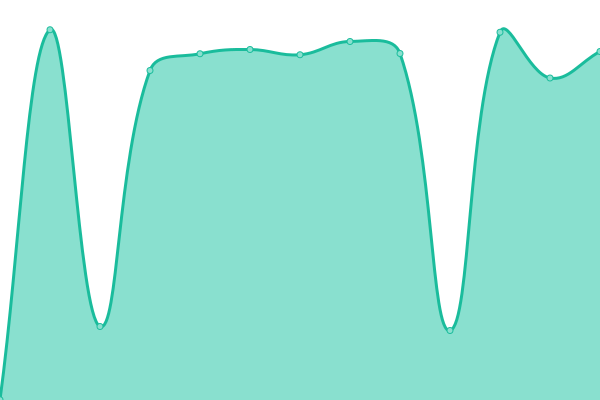
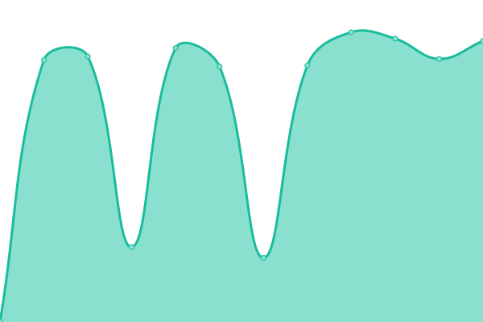
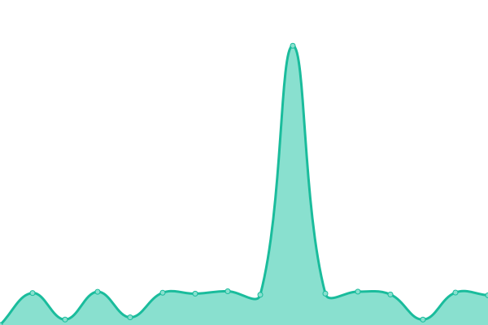
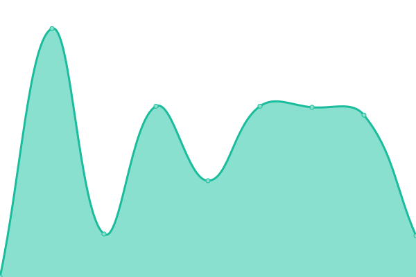
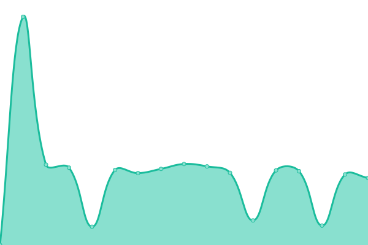
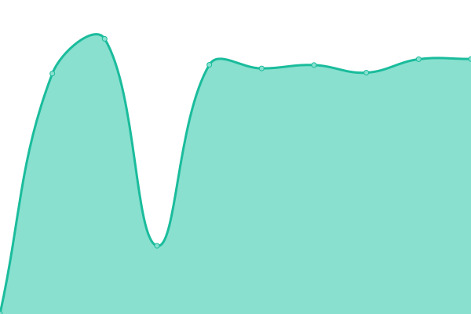
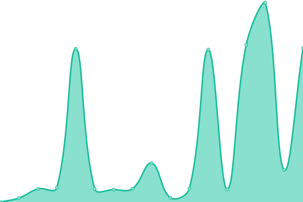
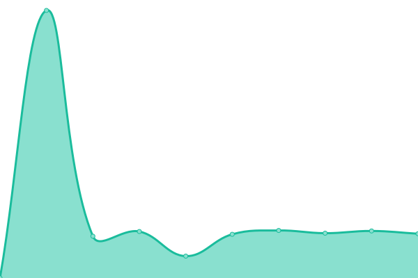
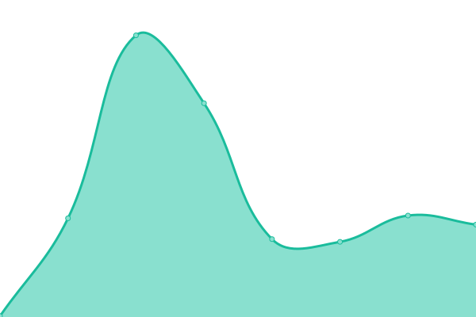
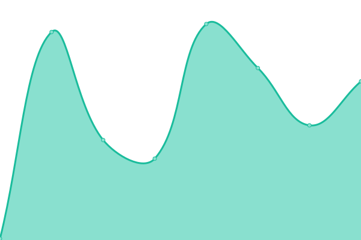

# [📈 Live Status](https://barctic.github.io/gnwt-monitor): <!--live status--> **🟧 Partial outage**

This repository contains the open-source uptime monitor and status page for [barctic](https://barctic.com), powered by [Upptime](https://github.com/upptime/upptime).

With [Upptime](https://upptime.js.org), you can get your own unlimited and free uptime monitor and status page, powered entirely by a GitHub repository. We use [Issues](https://github.com/barctic/gnwt-monitor/issues) as incident reports, [Actions](https://github.com/barctic/gnwt-monitor/actions) as uptime monitors, and [Pages](https://barctic.github.io/gnwt-monitor) for the status page.

<!--start: status pages-->
<!-- This summary is generated by Upptime (https://github.com/upptime/upptime) -->
<!-- Do not edit this manually, your changes will be overwritten -->
<!-- prettier-ignore -->
| URL | Status | History | Response Time | Uptime |
| --- | ------ | ------- | ------------- | ------ |
|  [GNWT Main Page](https://www.gov.nt.ca) | 🟩 Up | [gnwt-main-page.yml](https://github.com/Barctic/gnwt-monitor/commits/HEAD/history/gnwt-main-page.yml) | 

 408ms
     
 | 

<a href="https://Barctic.github.io/gnwt-monitor/history/gnwt-main-page">98.74%</a>
    

|  [Education Culture and Employment](https://www.ece.gov.nt.ca) | 🟩 Up | [education-culture-and-employment.yml](https://github.com/Barctic/gnwt-monitor/commits/HEAD/history/education-culture-and-employment.yml) | 

 1122ms
     
 | 

<a href="https://Barctic.github.io/gnwt-monitor/history/education-culture-and-employment">99.82%</a>
    

|  [Environment and Natural Resources](https://www.enr.gov.nt.ca) | 🟩 Up | [environment-and-natural-resources.yml](https://github.com/Barctic/gnwt-monitor/commits/HEAD/history/environment-and-natural-resources.yml) | 

 1929ms
     
 | 

<a href="https://Barctic.github.io/gnwt-monitor/history/environment-and-natural-resources">93.96%</a>
    

|  [Executive and Indigenous Affairs](https://www.eia.gov.nt.ca) | 🟩 Up | [executive-and-indigenous-affairs.yml](https://github.com/Barctic/gnwt-monitor/commits/HEAD/history/executive-and-indigenous-affairs.yml) | 

 887ms
     
 | 

<a href="https://Barctic.github.io/gnwt-monitor/history/executive-and-indigenous-affairs">98.20%</a>
    

|  [Finance](https://www.fin.gov.nt.ca) | 🟩 Up | [finance.yml](https://github.com/Barctic/gnwt-monitor/commits/HEAD/history/finance.yml) | 

 1383ms
     
 | 

<a href="https://Barctic.github.io/gnwt-monitor/history/finance">98.95%</a>
    

|  [Health and Social Services](https://www.hss.gov.nt.ca) | 🟩 Up | [health-and-social-services.yml](https://github.com/Barctic/gnwt-monitor/commits/HEAD/history/health-and-social-services.yml) | 

 1005ms
     
 | 

<a href="https://Barctic.github.io/gnwt-monitor/history/health-and-social-services">99.77%</a>
    

|  [Industry, Tourism and Investment](https://www.iti.gov.nt.ca) | 🟩 Up | [industry-tourism-and-investment.yml](https://github.com/Barctic/gnwt-monitor/commits/HEAD/history/industry-tourism-and-investment.yml) | 

 898ms
     
 | 

<a href="https://Barctic.github.io/gnwt-monitor/history/industry-tourism-and-investment">99.68%</a>
    

|  [Infrastructure](https://www.inf.gov.nt.ca) | 🟩 Up | [infrastructure.yml](https://github.com/Barctic/gnwt-monitor/commits/HEAD/history/infrastructure.yml) | 

 1047ms
     
 | 

<a href="https://Barctic.github.io/gnwt-monitor/history/infrastructure">98.26%</a>
    

|  [Justice](https://www.justice.gov.nt.ca) | 🟩 Up | [justice.yml](https://github.com/Barctic/gnwt-monitor/commits/HEAD/history/justice.yml) | 

 671ms
     
 | 

<a href="https://Barctic.github.io/gnwt-monitor/history/justice">100.00%</a>
    

|  [Lands](https://www.lands.gov.nt.ca) | 🟩 Up | [lands.yml](https://github.com/Barctic/gnwt-monitor/commits/HEAD/history/lands.yml) | 

 2172ms
     
 | 

<a href="https://Barctic.github.io/gnwt-monitor/history/lands">94.62%</a>
    

|  [Legislative Assembly](https://www.ntassembly.ca) | 🟥 Down | [legislative-assembly.yml](https://github.com/Barctic/gnwt-monitor/commits/HEAD/history/legislative-assembly.yml) | 

 1508ms
     
 | 

<a href="https://Barctic.github.io/gnwt-monitor/history/legislative-assembly">99.15%</a>
    

|  [Municipal and Community Affairs](https://www.maca.gov.nt.ca) | 🟩 Up | [municipal-and-community-affairs.yml](https://github.com/Barctic/gnwt-monitor/commits/HEAD/history/municipal-and-community-affairs.yml) | 

 895ms
     
 | 

<a href="https://Barctic.github.io/gnwt-monitor/history/municipal-and-community-affairs">99.35%</a>
    

|  [Aurora College](https://www.auroracollege.nt.ca) | 🟩 Up | [aurora-college.yml](https://github.com/Barctic/gnwt-monitor/commits/HEAD/history/aurora-college.yml) | 

 2393ms
     
 | 

<a href="https://Barctic.github.io/gnwt-monitor/history/aurora-college">100.00%</a>
    

|  [NWT Business Development and Investment Corporation](https://www.bdic.ca) | 🟩 Up | [nwt-business-development-and-investment-corporation.yml](https://github.com/Barctic/gnwt-monitor/commits/HEAD/history/nwt-business-development-and-investment-corporation.yml) | 

 2786ms
     
 | 

<a href="https://Barctic.github.io/gnwt-monitor/history/nwt-business-development-and-investment-corporation">100.00%</a>
    

|  [Health and Social Services Authority](https://www.nthssa.ca) | 🟩 Up | [health-and-social-services-authority.yml](https://github.com/Barctic/gnwt-monitor/commits/HEAD/history/health-and-social-services-authority.yml) | 

 1527ms
     
 | 

<a href="https://Barctic.github.io/gnwt-monitor/history/health-and-social-services-authority">98.92%</a>
    

|  [Hay River Health and Social Services Authority](https://www.hrhssa.org/) | 🟩 Up | [hay-river-health-and-social-services-authority.yml](https://github.com/Barctic/gnwt-monitor/commits/HEAD/history/hay-river-health-and-social-services-authority.yml) | 

 359ms
     
 | 

<a href="https://Barctic.github.io/gnwt-monitor/history/hay-river-health-and-social-services-authority">100.00%</a>
    

|  [NWT Housing Corporation](https://www.nwthc.gov.nt.ca) | 🟩 Up | [nwt-housing-corporation.yml](https://github.com/Barctic/gnwt-monitor/commits/HEAD/history/nwt-housing-corporation.yml) | 

 999ms
     
 | 

<a href="https://Barctic.github.io/gnwt-monitor/history/nwt-housing-corporation">91.50%</a>
    

|  [Northwest Territories Liquor and Cannabis Commission](https://www.ntlcc.ca) | 🟩 Up | [northwest-territories-liquor-and-cannabis-commission.yml](https://github.com/Barctic/gnwt-monitor/commits/HEAD/history/northwest-territories-liquor-and-cannabis-commission.yml) | 

 1243ms
     
 | 

<a href="https://Barctic.github.io/gnwt-monitor/history/northwest-territories-liquor-and-cannabis-commission">100.00%</a>
    

|  [Northwest Territories Power Corporation](https://www.ntpc.com/) | 🟩 Up | [northwest-territories-power-corporation.yml](https://github.com/Barctic/gnwt-monitor/commits/HEAD/history/northwest-territories-power-corporation.yml) | 

 270ms
     
 | 

<a href="https://Barctic.github.io/gnwt-monitor/history/northwest-territories-power-corporation">100.00%</a>
    

|  [Tlicho Community Services Agency](https://www.tlicho.ca/agencies/tlicho-community-services-agency) | 🟩 Up | [tlicho-community-services-agency.yml](https://github.com/Barctic/gnwt-monitor/commits/HEAD/history/tlicho-community-services-agency.yml) | 

 138ms
     
 | 

<a href="https://Barctic.github.io/gnwt-monitor/history/tlicho-community-services-agency">100.00%</a>
    

|  [Workers Safety and Compensation Commission](https://www.wscc.nt.ca) | 🟩 Up | [workers-safety-and-compensation-commission.yml](https://github.com/Barctic/gnwt-monitor/commits/HEAD/history/workers-safety-and-compensation-commission.yml) | 

 260ms
     
 | 

<a href="https://Barctic.github.io/gnwt-monitor/history/workers-safety-and-compensation-commission">100.00%</a>
    

<!--end: status pages-->

[**Visit our status website →**](https://barctic.github.io/gnwt-monitor)

## 📄 License

- Powered by: [Upptime](https://github.com/upptime/upptime)
- Code: [MIT](./LICENSE) © [Barctic Technology](https://barctic.com)
- Data in the `./history` directory: [Open Database License](https://opendatacommons.org/licenses/odbl/1-0/)
