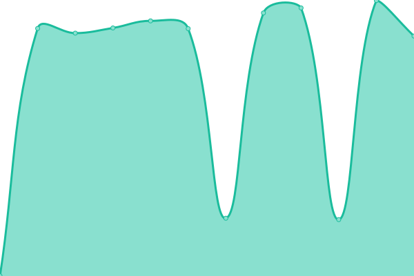
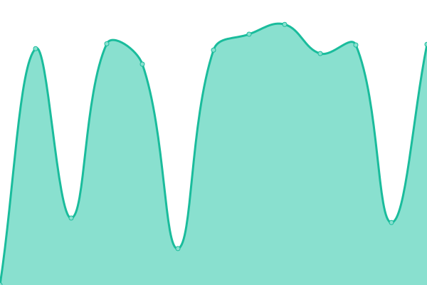
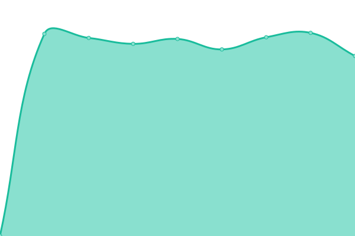
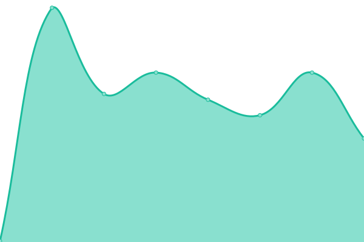

# [📈 Live Status](https://barctic.github.io/gnwt-monitor): <!--live status--> **🟧 Partial outage**

This repository contains the open-source uptime monitor and status page for [barctic](https://barctic.com), powered by [Upptime](https://github.com/upptime/upptime).

With [Upptime](https://upptime.js.org), you can get your own unlimited and free uptime monitor and status page, powered entirely by a GitHub repository. We use [Issues](https://github.com/barctic/gnwt-monitor/issues) as incident reports, [Actions](https://github.com/barctic/gnwt-monitor/actions) as uptime monitors, and [Pages](https://barctic.github.io/gnwt-monitor) for the status page.

<!--start: status pages-->
<!-- This summary is generated by Upptime (https://github.com/upptime/upptime) -->
<!-- Do not edit this manually, your changes will be overwritten -->
<!-- prettier-ignore -->
| URL | Status | History | Response Time | Uptime |
| --- | ------ | ------- | ------------- | ------ |
|  [GNWT Main Page](https://www.gov.nt.ca) | 🟩 Up | [gnwt-main-page.yml](https://github.com/Barctic/gnwt-monitor/commits/HEAD/history/gnwt-main-page.yml) | 

 404ms
     
 | 

<a href="https://Barctic.github.io/gnwt-monitor/history/gnwt-main-page">100.00%</a>
    

|  [Education Culture and Employment](https://www.ece.gov.nt.ca) | 🟩 Up | [education-culture-and-employment.yml](https://github.com/Barctic/gnwt-monitor/commits/HEAD/history/education-culture-and-employment.yml) | 

 1229ms
     
 | 

<a href="https://Barctic.github.io/gnwt-monitor/history/education-culture-and-employment">100.00%</a>
    

|  [Environment and Natural Resources](https://www.enr.gov.nt.ca) | 🟩 Up | [environment-and-natural-resources.yml](https://github.com/Barctic/gnwt-monitor/commits/HEAD/history/environment-and-natural-resources.yml) | 

 1519ms
     
 | 

<a href="https://Barctic.github.io/gnwt-monitor/history/environment-and-natural-resources">99.65%</a>
    

|  [Executive and Indigenous Affairs](https://www.eia.gov.nt.ca) | 🟩 Up | [executive-and-indigenous-affairs.yml](https://github.com/Barctic/gnwt-monitor/commits/HEAD/history/executive-and-indigenous-affairs.yml) | 

 885ms
     
 | 

<a href="https://Barctic.github.io/gnwt-monitor/history/executive-and-indigenous-affairs">99.44%</a>
    

|  [Finance](https://www.fin.gov.nt.ca) | 🟩 Up | [finance.yml](https://github.com/Barctic/gnwt-monitor/commits/HEAD/history/finance.yml) | 

 1341ms
     
 | 

<a href="https://Barctic.github.io/gnwt-monitor/history/finance">99.82%</a>
    

|  [Health and Social Services](https://www.hss.gov.nt.ca) | 🟩 Up | [health-and-social-services.yml](https://github.com/Barctic/gnwt-monitor/commits/HEAD/history/health-and-social-services.yml) | 

 1054ms
     
 | 

<a href="https://Barctic.github.io/gnwt-monitor/history/health-and-social-services">100.00%</a>
    

|  [Industry, Tourism and Investment](https://www.iti.gov.nt.ca) | 🟩 Up | [industry-tourism-and-investment.yml](https://github.com/Barctic/gnwt-monitor/commits/HEAD/history/industry-tourism-and-investment.yml) | 

 924ms
     
 | 

<a href="https://Barctic.github.io/gnwt-monitor/history/industry-tourism-and-investment">99.28%</a>
    

|  [Infrastructure](https://www.inf.gov.nt.ca) | 🟩 Up | [infrastructure.yml](https://github.com/Barctic/gnwt-monitor/commits/HEAD/history/infrastructure.yml) | 

 1004ms
     
 | 

<a href="https://Barctic.github.io/gnwt-monitor/history/infrastructure">99.43%</a>
    

|  [Justice](https://www.justice.gov.nt.ca) | 🟩 Up | [justice.yml](https://github.com/Barctic/gnwt-monitor/commits/HEAD/history/justice.yml) | 

 725ms
     
 | 

<a href="https://Barctic.github.io/gnwt-monitor/history/justice">100.00%</a>
    

|  [Lands](https://www.lands.gov.nt.ca) | 🟥 Down | [lands.yml](https://github.com/Barctic/gnwt-monitor/commits/HEAD/history/lands.yml) | 

 0ms
     
 | 

<a href="https://Barctic.github.io/gnwt-monitor/history/lands">0.00%</a>
    

|  [Legislative Assembly](https://www.ntassembly.ca) | 🟩 Up | [legislative-assembly.yml](https://github.com/Barctic/gnwt-monitor/commits/HEAD/history/legislative-assembly.yml) | 

 645ms
     
 | 

<a href="https://Barctic.github.io/gnwt-monitor/history/legislative-assembly">100.00%</a>
    

|  [Municipal and Community Affairs](https://www.maca.gov.nt.ca) | 🟩 Up | [municipal-and-community-affairs.yml](https://github.com/Barctic/gnwt-monitor/commits/HEAD/history/municipal-and-community-affairs.yml) | 

 996ms
     
 | 

<a href="https://Barctic.github.io/gnwt-monitor/history/municipal-and-community-affairs">99.72%</a>
    

|  [Aurora College](https://www.auroracollege.nt.ca) | 🟩 Up | [aurora-college.yml](https://github.com/Barctic/gnwt-monitor/commits/HEAD/history/aurora-college.yml) | 

 2813ms
     
 | 

<a href="https://Barctic.github.io/gnwt-monitor/history/aurora-college">99.77%</a>
    

|  [NWT Business Development and Investment Corporation](https://www.bdic.ca) | 🟥 Down | [nwt-business-development-and-investment-corporation.yml](https://github.com/Barctic/gnwt-monitor/commits/HEAD/history/nwt-business-development-and-investment-corporation.yml) | 

 956ms
     
 | 

<a href="https://Barctic.github.io/gnwt-monitor/history/nwt-business-development-and-investment-corporation">100.00%</a>
    

|  [Health and Social Services Authority](https://www.nthssa.ca) | 🟩 Up | [health-and-social-services-authority.yml](https://github.com/Barctic/gnwt-monitor/commits/HEAD/history/health-and-social-services-authority.yml) | 

 1059ms
     
 | 

<a href="https://Barctic.github.io/gnwt-monitor/history/health-and-social-services-authority">99.77%</a>
    

|  [Hay River Health and Social Services Authority](https://www.hrhssa.org/) | 🟩 Up | [hay-river-health-and-social-services-authority.yml](https://github.com/Barctic/gnwt-monitor/commits/HEAD/history/hay-river-health-and-social-services-authority.yml) | 

 309ms
     
 | 

<a href="https://Barctic.github.io/gnwt-monitor/history/hay-river-health-and-social-services-authority">100.00%</a>
    

|  [NWT Housing Corporation](https://www.nwthc.gov.nt.ca) | 🟩 Up | [nwt-housing-corporation.yml](https://github.com/Barctic/gnwt-monitor/commits/HEAD/history/nwt-housing-corporation.yml) | 

 1000ms
     
 | 

<a href="https://Barctic.github.io/gnwt-monitor/history/nwt-housing-corporation">99.73%</a>
    

|  [Northwest Territories Liquor and Cannabis Commission](https://www.ntlcc.ca) | 🟩 Up | [northwest-territories-liquor-and-cannabis-commission.yml](https://github.com/Barctic/gnwt-monitor/commits/HEAD/history/northwest-territories-liquor-and-cannabis-commission.yml) | 

 587ms
     
 | 

<a href="https://Barctic.github.io/gnwt-monitor/history/northwest-territories-liquor-and-cannabis-commission">100.00%</a>
    

|  [Northwest Territories Power Corporation](https://www.ntpc.com/) | 🟩 Up | [northwest-territories-power-corporation.yml](https://github.com/Barctic/gnwt-monitor/commits/HEAD/history/northwest-territories-power-corporation.yml) | 

 157ms
     
 | 

<a href="https://Barctic.github.io/gnwt-monitor/history/northwest-territories-power-corporation">100.00%</a>
    

|  [Tlicho Community Services Agency](https://www.tlicho.ca/agencies/tlicho-community-services-agency) | 🟥 Down | [tlicho-community-services-agency.yml](https://github.com/Barctic/gnwt-monitor/commits/HEAD/history/tlicho-community-services-agency.yml) | 

 82ms
     
 | 

<a href="https://Barctic.github.io/gnwt-monitor/history/tlicho-community-services-agency">0.00%</a>
    

|  [Workers Safety and Compensation Commission](https://www.wscc.nt.ca) | 🟩 Up | [workers-safety-and-compensation-commission.yml](https://github.com/Barctic/gnwt-monitor/commits/HEAD/history/workers-safety-and-compensation-commission.yml) | 

 336ms
     
 | 

<a href="https://Barctic.github.io/gnwt-monitor/history/workers-safety-and-compensation-commission">100.00%</a>
    

<!--end: status pages-->

[**Visit our status website →**](https://barctic.github.io/gnwt-monitor)

## 📄 License

- Powered by: [Upptime](https://github.com/upptime/upptime)
- Code: [MIT](./LICENSE) © [Barctic Technology](https://barctic.com)
- Data in the `./history` directory: [Open Database License](https://opendatacommons.org/licenses/odbl/1-0/)
